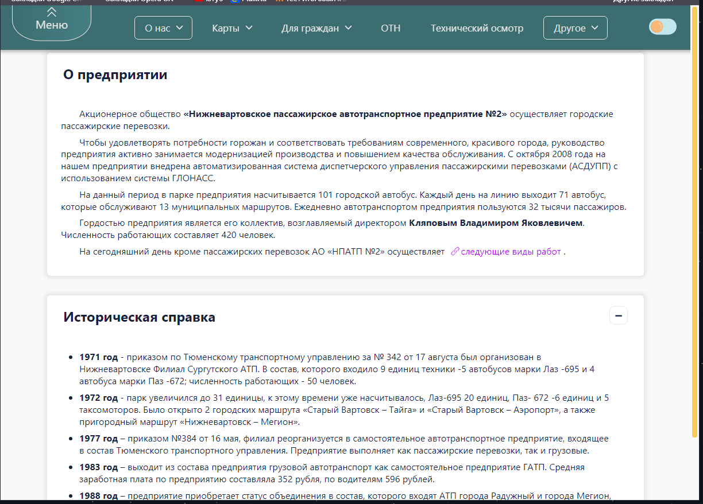
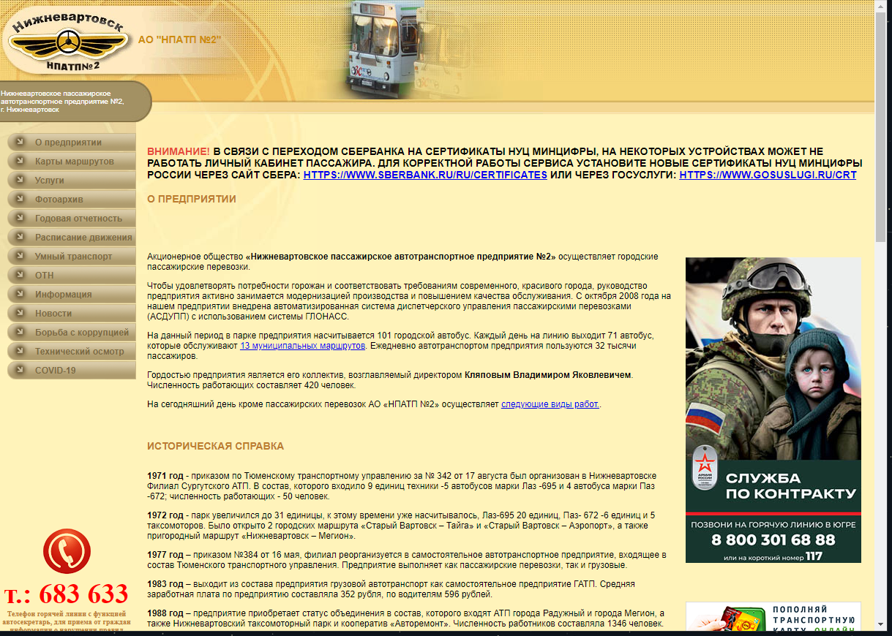

# Обновленный интерфейс сайта ПАТП-2

Данный проект представляет собой обновленный интерфейс сайта предприятия ПАТП-2.

## Технологии
* **[Next.js](https://nextjs.org/)** для фронтенда
* **[React](https://react.dev/)** для создания пользовательского интерфейса
* **[SCSS](https://sass-lang.com/)** для стилей
  
## Установка и запуск
1. Склонируйте репозиторий на свой локальный компьютер:
``` bash
git clone https://github.com/LlienlL/patp2_new_sait.git
```
2. Перейдите в каталог проекта:
``` bash
cd patp2_new_sait
```
3. Установите зависимости:
``` bash
npm install
```
4. Запустите приложение:
``` bash
npm run start
```
5. Откройте веб-браузер и перейдите по адресу http://localhost:3000 для просмотра сайта.

Как итог мы увидим данный сайт:



До изменения сайт выглядим следующим образом:


Это не финальный вариант.